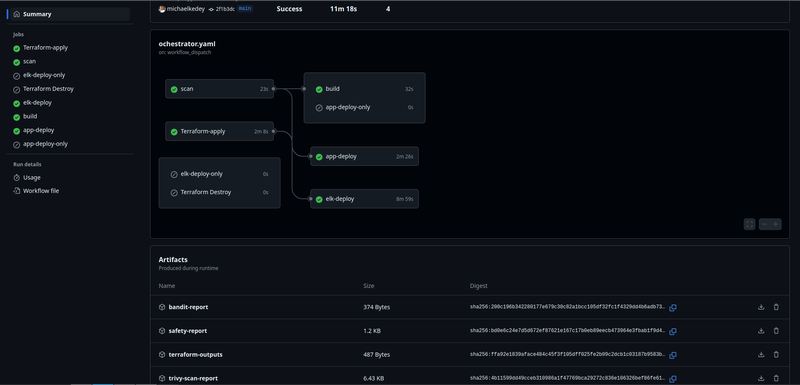
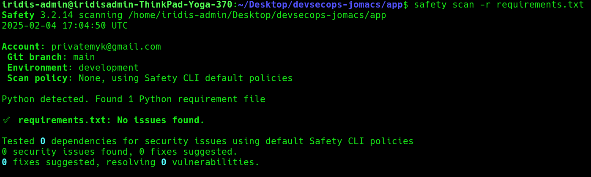
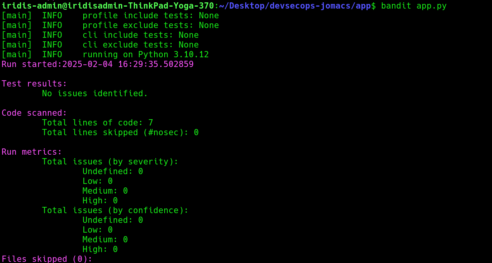
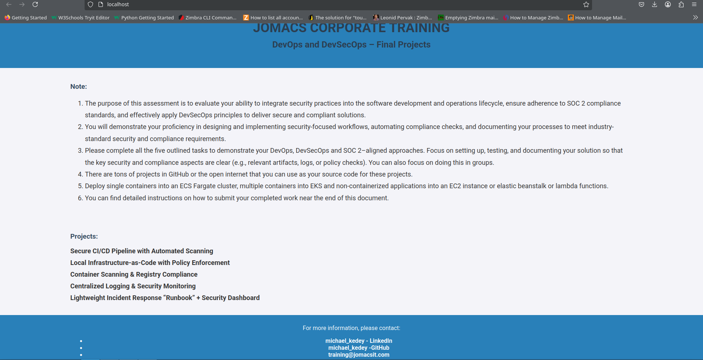
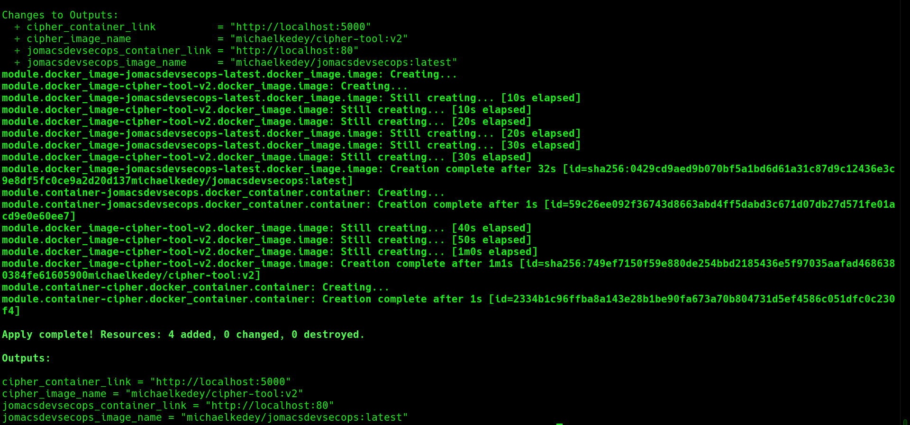
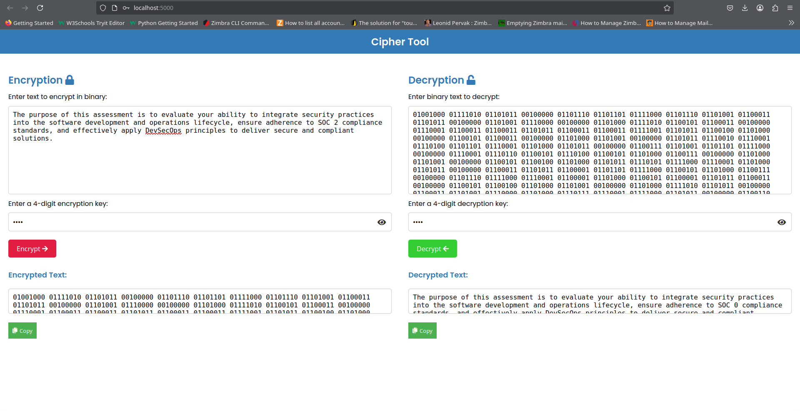
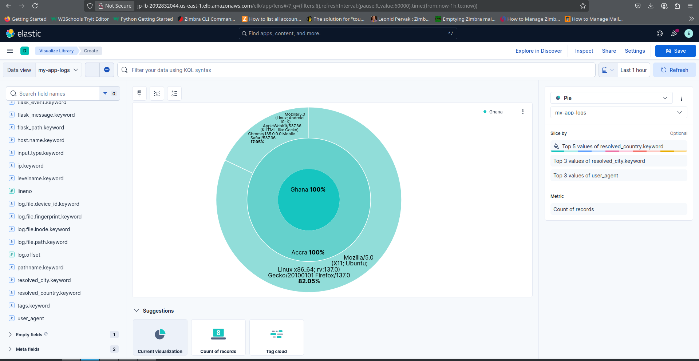
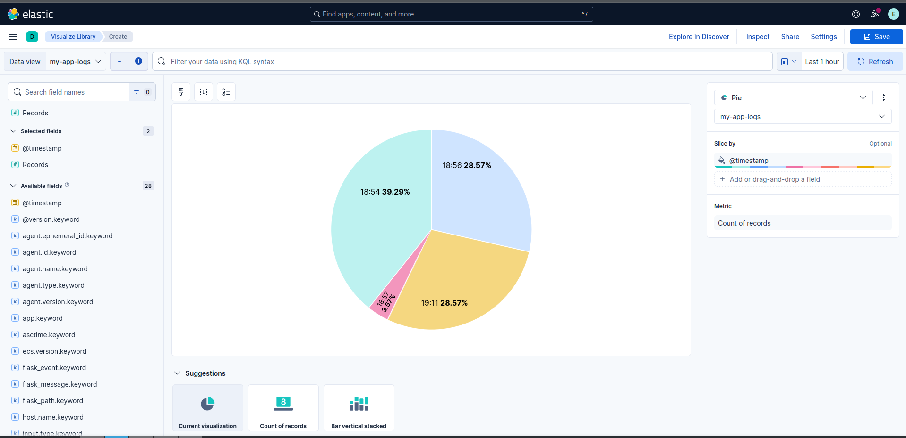
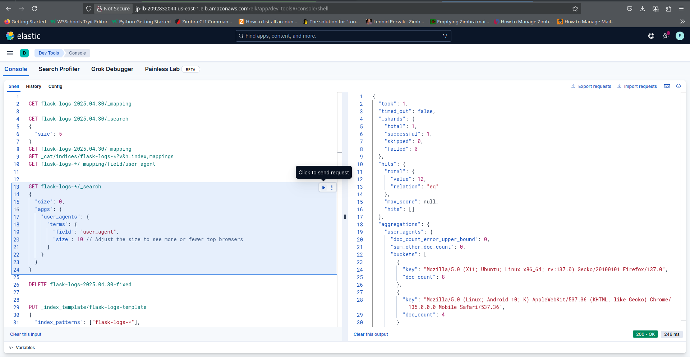

# devsecops-jomacs


## 1. Secure CI/CD Pipeline with Automated Scanning

### [cicd](./cicd/)
[](https://github.com/michaelkedey/devsecops-jomacs/actions/workflows/ochestrator.yaml)

 

- **[ochestrator.yaml](./cicd/ochestrator.yaml)**
  - A robust CI/CD pipeline that handles the full deployment lifecycle of the application and its supporting infrastructure. This workflow defines several key jobs, including:
    - [infrastructure setup]( .github/workflows/ochestrator#L26)
    - [code scan]( .github/workflows/ochestrator#L90)
    - [docker image build and upload to dockerhub]( .github/workflows/ochestrator#L135)
    - [application deploy]( .github/workflows/ochestrator#L188)
      - [scan + application deploy only](.github/workflows/ochestrator#L258)
    - [elk deploy]( .github/workflows/ochestrator#L547)
      - [elk deploy only](.github/workflows/ochestrator#L320)
    - [infrastructure destroy]( .github/workflows/ochestrator#L935)
  - this workflow has reusable code defined in action file, that are callable in the main workflow
    - [actions/app/action.yml](.github/actions/app/action.yaml)
    - [actions/elk/action.yml](.github/actions/elk/action.yaml)
  - this workflow can be triggered manually ny selecting one of these options
    * full-deploy
      * triggers full deployment, including infrastructure set up, code scan, docker imge bulding and deploy to [dockerhub](https://hub.docker.com/u/michaelkedey). Application deployment depends on succesful completion of both scan and infrastracture deployment jobs, elk server deployment relies on succesful completion of infrastructure deploy job only. scan, build, and infrsatructure deploy jobs are stand alone jobs
    * destroy (destruction of infrastracture)
    * infra-only
      * trigers infrastructure deploy only job
    * scan-only 
      * triggers code scanning only job
    * build-only
      * triggers docker image build, job only
    * deploy-elk-only
      * triggers elk server deployment only, not depending on infrasdtructure setup
    * scan+deploy-app-only
      * trigers the scan and application server deployments, application server deployment job fully relying on succesful code scanning job
    * scan+deploy-app-only+deploy-elk-only
      * trigers the scan, application server deployments and elk server deployment, application server deployment job fully relying on succesful code scanning job, and neither server jobs depending on infrsatructure setup
    * infra+scan+app
    * infra+scan+app+elk 
    * infra+elk
    * scan+build
  - deployment logs from all the jobs are sent to an S3 bucket on aws
  - credentials like elsatic search password asre also extracted, and gpg encrypted, and securely sent to AWS S3 bucket 
  - terraform apply outputs are also securly sent to aws s3 bucket

- **[infra.yaml](./cicd/infra.yaml)**
- [infrastructure setup]([.github/workflows/ochestrator.yaml]( .github/workflows/ochestrator#L26))
  - designed to to create the necessary AWS resources for the pipeline,including;
      * [a vpc](infra/aws/main.tf#L5) with private and public subnets in multiple availability zones
      * 2 private application servers, in different private subnets
      * [a jumper server](infra/aws/main.tf#L20) in a public subnet fo secure acces to the private servers
      * [a loadbalancer](infra/aws/main.tf#L41) for public access to the private servers via dns
      * a nat gateway for outbound access from the private subnets
      * an internet gateway for public access to the loadbalancer
      * custom ssh ports for secure access to all servers
      * appropriate security groupd and rules, securely allowing access only on approved ports the servers
        * [application server security group](infra/aws/modules/loadbalancer/lb.tf#L76)
          * allows ingress ssh tunnel access to the application server from the jumper server, on a custom ssh port
          * allows ingress http access to the app server from the loadbalnacer security group only
          * allows all egress traffic
        * [elk server security group](infra/aws/modules/loadbalancer/lb.tf#L145)
          * allows ingress ssh tunnel access to the application server from the jumper server, on a custom ssh port
          * allows access to the kibana ui from the loadbalancer security group only, on the kibana port
          * allows ingress acces to the logstash application from the sceuroty group of the application server only
          * allows all egress traffic
        * [jumper server security group](infra/aws/modules/loadbalancer/lb.tf#L114)
          * allows ingress ssh tunne acces to the jumper host from everywhere on a custom ssh port only
          * allows all egress traffic
      * target groups for the loadbalancer listener
  - this workflow is trgiggerd manually, by selecting either any of the options below
        * - full-deploy 

- **[app.yaml](./cicd/app.yaml):**
- [application deploy]( .github/workflows/ochestrator#L188) designed to securely deploy the application to the private server, employing multiple strategies to ensure the application is deployed securely, including;
  * safety scan for vulnerabilities 
      * [safety-scan.json](./app/python/scan-reports/safety-report.json)
      * 
  * bandit scans for security issues
      * [bandit-scan.json](./app/python/scan-reports/bandit-report.json)
      * 
  * generating scan reports for auditing
  * failing app deployments if any security issues are found, to prevent insecure deployments.
  * using ssh and rsync to securely transfer files to the private server from the bastion via custom ssh ports, only when the sfacety and security checks pass.
  * starting the app and verifying it is running on the private server
  * application architecture
    * the python app is started via gunicorn on the custom application port
    * the app runs behind an nginx reverse procy which listend for http traffic on port 80, and fowards same to the python app running on a custom port
    * logs from the python app are colecetd and processed by `Filebeat` which sends same to `Logstash` on the elk server 
  * 
  
- **[docker.yaml](./cicd/):**
- [docker image build and upload]( .github/workflows/ochestrator#L135) this workflow securely automates the scanning, creation and deployment of the created docker image to dockerhub. It performs a trivy scan of the created image, and on success, the image is deployed to dockerhub. On failure however, the image is not deployed. ;
    * trivy scan for vulnerabilities
      * [trivy-scan.json](./app/python/scan-reports/trivy-scanreport.json)
    * generating scan reports for auditing
    * failing image deployments to dockerhub if any security issues are found.
  
### [app code](./app/)
- [ciphertool](./app/ciphertool/ciphertool.md)
    * contains docker pull command to run the cipher-tool application
      * Features - CipherTool - Secure text encryption tool. 
        *   **Complex Encryption**: Transform text using a proprietary algorithm
        *   **4-Digit Code Security**: PIN-protected encryption/decryption
        *   **Terraform Automation**: Single-command deployment/destruction
        *   **Docker Containerization**: Lightweight and portable 
    * Docker Image: [michaelkedey/cipher-tool:v2](https://hub.docker.com/r/michaelkedey/cipher-tool/tags)
      - please use v2.
    * Live Demo: http://localhost:5000
    * please see [installation guide](./infra/local/docker/README.md): on how to lunch the application

- [python](./app/python/)
    * contains the python application code which runs on the private server


## 2. Local Infrastructure-as-Code with Policy Enforcement
### [infra](./infra/)
- [local/docker](./infra/local/docker/): uses terraform iac, including terraform modules to create the local infrsatructure of 4 docker resources for local docker container deplyment. Resources include:
    * 2 containers
    * 2 [docker images](https://hub.docker.com/r/michaelkedey/)
      * [michaelkedey/cipher-tool:v2](https://hub.docker.com/r/michaelkedey/cipher-tool/tags)
        * please use V2
      * [michaelkedey/jomacsdevsecops:latest](https://hub.docker.com/r/michaelkedey/jomacsdevsecops/tags)
    * Installation & Usage
      - Clone the repository: `https://github.com/michaelkedey/devsecops-jomacs.git`
          ```
          git clone https://github.com/michaelkedey/devsecops-jomacs.git
          cd devsecops-jomacs/infra/local/docker
          ```
      - Deploy Infrastructure
          ```
          terraform fmt --recursive    
          terraform plan     
          terraform apply --auto-approve
          ```
        * 
      - **Get the App Link:** After applying the Terraform configuration, Terraform will output the link to access the app. You can open the app in your browser to start using it. The app runs on port 5000 for the ecrption tool, and port 80 for the python app. Once the deployment is complete, open the app and try encrypting text by entering a 4-digit encryption code.
      - **Live Demo**
        *  http://localhost:5000
           *  
        *  http://localhost:80
           *  
      - Destroy Infrastructure
        ```
        terraform destroy --auto-approve
        ```


## 3. Container Scanning & Registry Compliance
### [app](./app/)
- [python](./app/python/)
  * contains the python application code bundled into a container image
  * [Dokerfile](./app/containerization/Dockerfile): used to create the containerized image of the [python-app](./app/python/)
- **[docker.yaml](./cicd/):** this workflow securely automates the scanning, creation and deployment of the created docker image to dockerhub. It performs a trivy scan of the created image, and on success, the image is deployed to dockerhub. On failure however, the image is not deployed. ;
    * trivy scan for vulnerabilities
      * [trivy-scan.json](./app/python/scan-reports/trivy-scanreport.json)
    * generating scan reports for auditing
    * failing image deployments to dockerhub if any security issues are found.


## 4. Centralized Logging & Security Monitoring
**App Server → Filebeat → Logstash → Elasticsearch → Kibana**
### **application server**
  - A `Python application` running on the App Server behind `Nginx` generates structured access and error logs.
  - Filebeat (log shipper) installed on the App Server forwards log files to `Logstash` on the `ELK stack`.
### **elk server**
  - Logstash on the ELK Server receives and processes logs,mparsing, filtering, and enriching them before passing them into Elasticsearch.
  - Elasticsearch indexes and stores the logs, making them searchable and analyzable.
  - Kibana provides a visual interface to explore the logs and create interactive dashboards.
- Index Creation & Log Discovery in Kibana
  - 1. Create Index Patterns on the kibana ui by visiting http://loadbalancer-url/elk/
    - Click the left hamburger icon, navigate to Kibana → Management → Stack Management → Index Patterns
    - Create an index pattern matching the logs (filebeat-*)
    - Select a time field (@timestamp) for time-based visualizations
  - 2. Dashboard Setup
    - Create visualizations and add them to a dashboard:
    - Select the flask index created earlier
  - Example Visualizations
    - piechart visualization based on Access Logs:
      - Requests by Country (country the python app is accessed from)
      - Browsers & OS used
      - Requests by City
    - 
    - 
    - 


### directory structure
```plaintext
.
├── app
│   ├── ciphertool
│   │   └── ciphertool.md
│   ├── containerization
│   │   └── Dockerfile
│   ├── python
│   │   ├── app.py
│   │   ├── appspec.yaml
│   │   ├── nohup.out
│   │   ├── __pycache__
│   │   │   └── app.cpython-310.pyc
│   │   ├── requirements.txt
│   │   ├── scan-reports
│   │   │   ├── bandit-report.json
│   │   │   ├── safety-report.json
│   │   │   └── trivy-scanreport.json
│   │   ├── static
│   │   │   └── css
│   │   │       └── styles.css
│   │   └── templates
│   │       └── index.html
│   └── security
│       └── config
├── cicd
│   ├── app.yaml
│   ├── docker.yaml
│   └── infra.yaml
├── images
│   ├── bandit.png
│   ├── cicddddddddddddddddddddddddddddddd.png
│   ├── docker1j.png
│   ├── docker3c.png
│   ├── docker.png
│   ├── kibabanana_country.png
│   ├── kibana_agentt.png
│   ├── kibana_city.png
│   ├── kibananaaaaaa.png
│   ├── kibananana_piechasrt.png
│   ├── README.md
│   ├── safety.png
│   └── workflow.png
├── infra
│   ├── aws
│   │   ├── ec2.md
│   │   ├── main.tf
│   │   ├── modules
│   │   │   ├── compute
│   │   │   │   ├── custome_ssh.sh
│   │   │   │   ├── ec2.tf
│   │   │   │   ├── output.tf
│   │   │   │   ├── providers.tf
│   │   │   │   └── vars.tf
│   │   │   ├── listener_and_tgs
│   │   │   │   ├── output.tf
│   │   │   │   ├── tg.tf
│   │   │   │   └── vars.tf
│   │   │   ├── loadbalancer
│   │   │   │   ├── lb.tf
│   │   │   │   ├── outputs.tf
│   │   │   │   ├── providers.tf
│   │   │   │   └── vars.tf
│   │   │   ├── networking
│   │   │   │   ├── output.tf
│   │   │   │   ├── providers.tf
│   │   │   │   ├── vars.tf
│   │   │   │   └── vpc.tf
│   │   │   └── secrets_manager
│   │   │       ├── secrets.tf
│   │   │       └── variables.tf
│   │   ├── output.tf
│   │   ├── providers.tf
│   │   └── vars.tf
│   ├── ecs
│   │   └── main.tf
│   └── local
│       └── docker
│           ├── main.tf
│           ├── modules
│           │   ├── container
│           │   │   ├── container.tf
│           │   │   ├── output.tf
│           │   │   ├── provider.tf
│           │   │   └── vars.tf
│           │   └── image
│           │       ├── image.tf
│           │       ├── output.tf
│           │       ├── provider.tf
│           │       └── var.tf
│           ├── output.tf
│           ├── provider.tf
│           ├── README.md
│           └── vars.tf
├── password.txt
└── README.md

28 directories, 67 files

```
